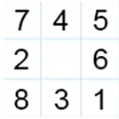

# Eight-Puzzle-Solver
AI model that solves an 8-puzzle problem using the A* search algorithm.

## Description

The proposed algorithm was written in MATLAB as a possible solver for the 8-puzzle problem.
An 8-puzzle can be imagined as a 3-by-3 grid with 8 blocks located inside this grid (Illustrated in Figure 1). The blocks are numbered 1 through 8 with one empty space. To solve this puzzle one needs to reorder the blocks in a numerical order by moving blocks only with the empty space.

    Figure 1. 8-puzzle 

## Algorithm

The algorithm solving an 8-puzzle problem can be solved by the following steps:
1. Accept the initial state and goal state input;
2. Check if the empty square can move up, down, left, or right;
3. Write down all new matrices obtained after performing the move in each possible direction;
4. Write down actual cost to reach the state, _g_ – the depth of all new matrices;
5. Calculate heuristic function _h_ – total Manhattan distance or number of misplaced tiles (depending on the initial choice) for each new matrix and write it down;
6. Calculate evaluation function _f_ by adding _g_ to _h_ for each new matrix;
7. Find all minimum values of _f_;
8. If there are more than one minimum value _f_ algorithm picks the one with the smaller depth _g_;
9. The matrix that corresponds to the minimum value _f_ becomes the current state;
10. Algorithm checks if the current state occurs among any known matrices. If it does then their values _f_ are set as NaN and Step 9 is repeated. By doing so one can assure that algorithm will not take the same matrix repeatedly;
11. Current state gets expanded;
12. Steps 2 – 9 are applied to all the matrices obtained after expanding until the goal state occurs as the current state.

    Figure 2. Example of the algorithm 

